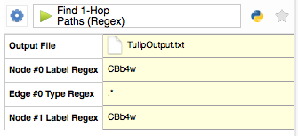
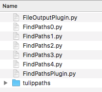

# TulipPaths
This is a set of Tulip plugins and python package for analyzing multi-hop relationships in [neuron connectivity graphs](http://connectomes.utah.edu/export/files.html#export-directly-from-a-url).

## Plugins

TulipPaths has plugins for analyzing and cleaning connectome data.

### Find paths plugins

The find paths plugins enable you to search for nodes and path by their labels inside the Tulip GUI.

Input to the 'Find Nodes (Regex)' plugin is a node label regex. This plugin outputs a list of nodes whose labels match the input to regex to your home directory. It also sets Tulip's view selection to the list of nodes. 

Sample input for the 'Find Nodes (Regex)' plugin:

Input to the 'Find n-Hop Paths (Regex)' is similar to the 'Find Nodes (Regex)' plugin. These plugins output a list of paths and update Tulip's view selection.

Sample input for the 'Find 1-Hop Paths (Regex)' plugin:

Sample output from the plugins inside Tulip:

### Find Missing Bidirectional Synapses

This plugin will search for bidirectional synapses that are missing reciprocal edges inside tulip.

You can specify which synapse type to search for, the default value is "Gap Junction."

Any edges that the plugin finds are output to the view selection and a user-specified text file. 

## Installation

These instructions assume that you want to use the plugins inside Tulip. If you plan on developing with the plugins, please see the dev environment wiki.

1. Click the 'clone or download' button and select 'download zip.' This will download TulipPaths-master.zip.
1. Expand TulipPaths-Master.zip into a folder TulipPaths-Master.
1. Create the Tulip plugins directory. On MacOS this is /Applications/Tulip-4.8.1.app/Contents/lib/tulip/python. On Windows it is something like C:\Program Files\Tulip/lib/tulip/python (If you have an older version of TulipPaths installed, make sure to delete all files from this directory.)
1. Copy the folder TulipPaths/tulippaths into the Tulip plugins directory.
1. Copy the contents of the TulipPaths/plugins into the Tulip plugins directory.
1. The Tulip plugins directory should contain these files:

You're now ready to run Tulip.
